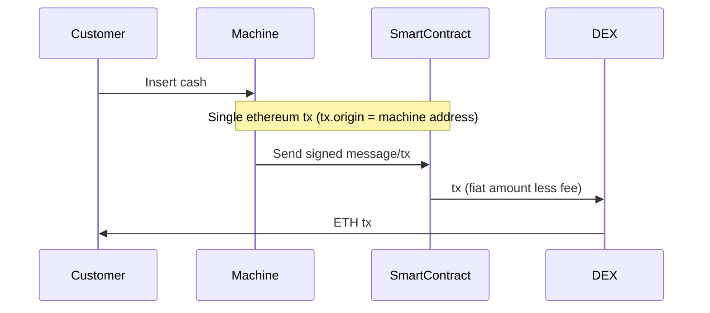
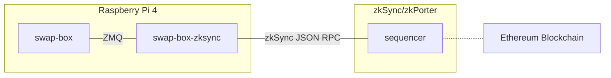
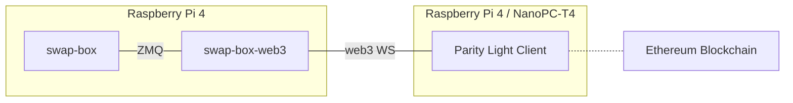
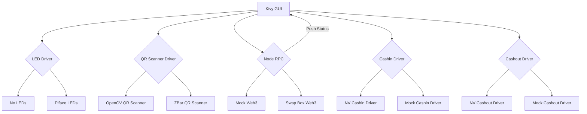

# Swap Box Documentation

## Repositories
- [swap-box](github.com/TrueLevelSA/swap-box)
  Swap box Kivy frontend
- [swap-box-web3](github.com/TrueLevelSA/swap-box-web3)
  Web3x bridge, accessible through ZMQ
- [swap-box-contract](github.com/TrueLevelSA/swap-box-contract)
  Smart contract implementation and tests
- [swap-box-admin](github.com/TrueLevelSA/swap-box-admin)
  Smart contract deployment

## Overall Architecture

### Transaction flow

### Current (L2/2.5 zkSync 2.0/zkPorter)

### Legacy (L1 onchain)

### Swap-box  Structure

#### Kivy
The GUI is started at boot time. All the drivers are selected when the GUI starts running using a config file (in `config_tools.py`).
Every driver is instanciated at this time as well. Only configuration operations are made in the constructors.
Then, when a driver is needed, the `start` function of the driver is called (usually when a screen needing the 
specific driver is shown to the user: `on_enter`/`on_pre_enter` functions). When a driver is not needed (usually when a screen is left, `on_leave`/`on_pre_leave` functions), the `stop` function of said driver is called.
As drivers are dynamically loaded at runtime, only one of each kind has to be working. For example, when running
on a PC, you don't have to compile the custom OpenCV QR scanner, and can use `zbarcam`.

#### LED Drivers
Basic `on`/`off` functions that switch a LED. Switched ON when a QR is being scanned.

#### QR Scanner
Used to scan a QR representing a public key.
- ZBar
  Uses `zbarcam` utility
- OpenCV
  Uses custom implementation of a scanner, located in `src_backends/qr_scanner/zbar_c`

#### Node RPC
Performs call to buy/sell crypto. Either connects to a `swap-box-web3` running instance or to `mock_services/mock_web3.py`, both using ZMQ.
A second ZMQ socket is used to push status from the node to the Kivy application in order to disable buy/sell
features when the node is not connected or not synchronized. Since this features prevents the user from making actions and can be counterproductive during development, it can be disabled by commenting out `self._config.STATUS.start()` in template `TemplateApp.build` function body.

#### Cashin/Cashout Drivers
Used when the customer puts money in the note validator or expects to receive some cash after a transaction.
Either connects to an actual NV machine through serial port or `mock_services/mock_validator.py` through ZMQ.